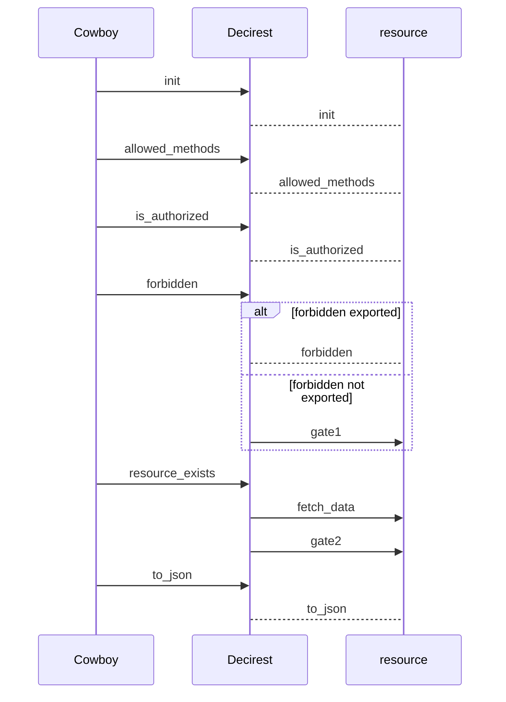
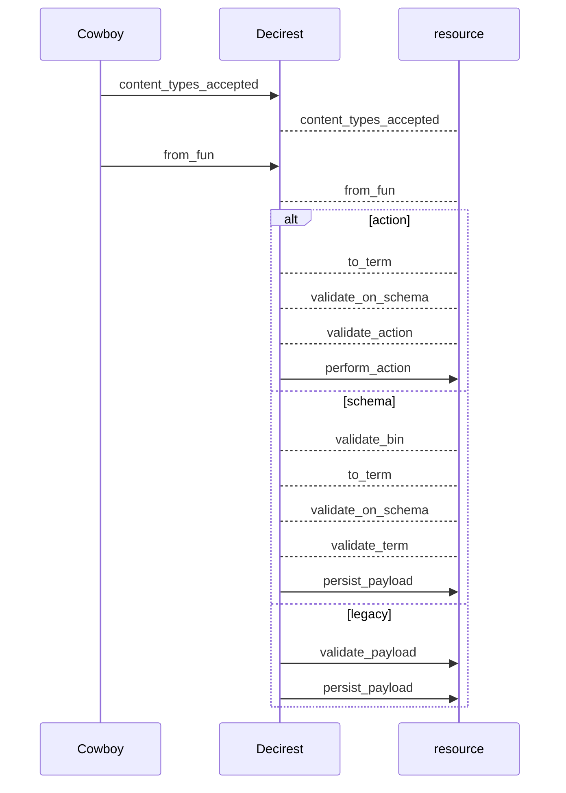

## Decirest sequence diagram

Filled arrows are always called. 
Dotted lines are called if exported

### GET

```mermaid
sequenceDiagram
participant Cowboy
participant Decirest
participant resource

Cowboy ->> Decirest: init
Decirest --> resource: init
Cowboy ->> Decirest: allowed_methods
Decirest --> resource: allowed_methods
Cowboy ->> Decirest: is_authorized
Decirest --> resource: is_authorized
Cowboy ->> Decirest: forbidden
alt forbidden exported
Decirest --> resource: forbidden
else forbidden not exported
Decirest ->> resource: gate1
end
Cowboy ->> Decirest: resource_exists
Decirest ->> resource: fetch_data
Decirest ->> resource: gate2
Cowboy ->> Decirest: to_json
Decirest --> resource: to_json
```

### POST PATCH
start with a complete GET sequence except for to_json

```mermaid
sequenceDiagram
participant Cowboy
participant Decirest
participant resource

Cowboy ->> Decirest: content_types_accepted
Decirest --> resource: content_types_accepted
Cowboy ->> Decirest: from_fun
Decirest --> resource: from_fun
alt action
Decirest --> resource: to_term
Decirest --> resource: validate_on_schema
Decirest --> resource: validate_action
Decirest ->> resource: perform_action
else schema
Decirest --> resource: validate_bin
Decirest --> resource: to_term
Decirest --> resource: validate_on_schema
Decirest --> resource: validate_term
Decirest ->> resource: persist_payload
else legacy
Decirest ->> resource: validate_payload
Decirest ->> resource: persist_payload
end
```